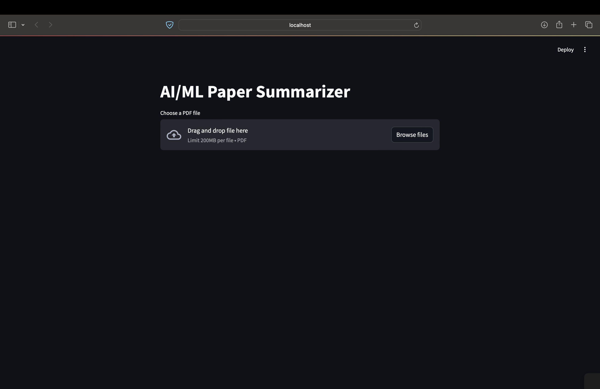
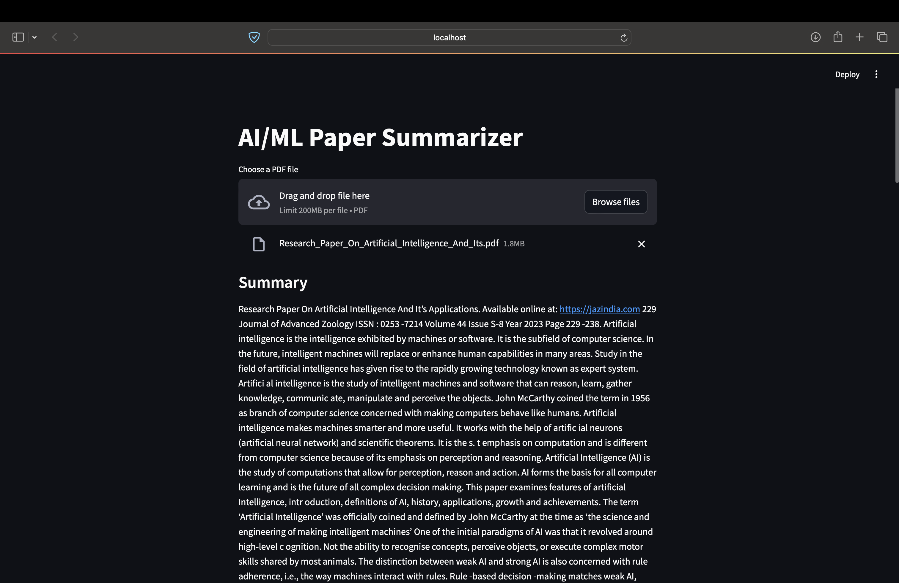
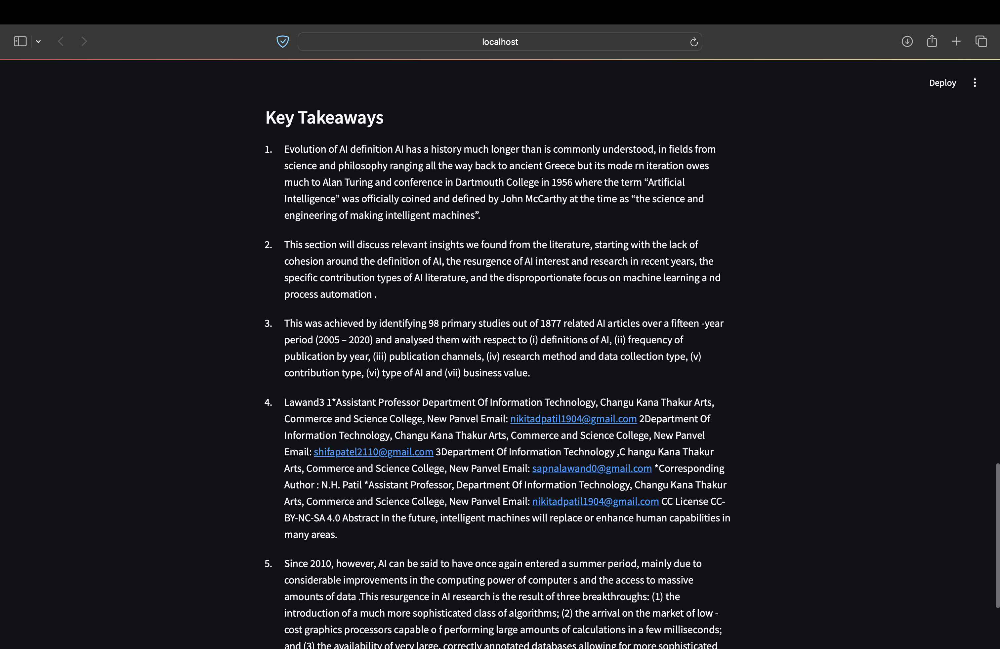

# AI Paper Summarizer

This project provides a user-friendly application to summarize research papers on Artificial Intelligence and Machine Learning. It allows users to upload a PDF file and receive a concise summary capturing the key takeaways of the paper.

<p align="center">
  
</p>

## Features

- **PDF Upload**: Upload research papers in PDF format.
- **Text Extraction**: Extracts text from the uploaded PDF file.
- **Text Preprocessing**: Cleans and prepares the extracted text for summarization.
- **Text Summarization**: Generates a concise summary of the paper using a pre-trained summarization model.
- **Key Takeaway Extraction**: Identifies and extracts the main points or contributions of the paper.
- **User Interface**: Presents the summary and key takeaways in a user-friendly web interface.

## Getting Started

### Prerequisites

- Python 3.9 ([Download Python](https://www.python.org/downloads/))
- pip (package installer for Python, usually comes bundled with Python)

### Required Libraries

- [PyPDF2](https://pypi.org/project/PyPDF2/)
- [transformers](https://huggingface.co/docs/transformers/en/index)
- [streamlit](https://docs.streamlit.io/)
- [nltk](https://www.nltk.org/)

### Installation

1. **Clone this repository** or download the project files.

   ```bash
   git clone https://github.com/Aidirrr/ai-paper-summarizer.git
   cd ai-paper-summarizer
   ```
  
2. **Create a virtual environment** (recommended) to isolate project dependencies.

    ```bash
    python -m venv venv
    source venv/bin/activate  # On Windows, use: venv\Scripts\activate
    ```

3. **Install the required libraries**:

    ```bash
     pip install PyPDF2 transformers streamlit nltk
    ```

5. **Download NLTK data** (used for sentence tokenization and stopword removal):

    ```bash
   python download_nltk_data.py  # Run the provided script to download NLTK resources
    ```

### Running the Application

1. **Open a terminal** in the project directory.
2. **Start the Streamlit app**:

    ```bash
   streamlit run app.py
    ```

4. **Access the application** in your web browser. By default, it will run at `http://localhost:8501`.

## Usage

1. Open the application in your web browser.
2. Click the **"Choose File"** button and select your research paper PDF.
3. Click **"Summarize"**.
4. The application will process the paper and display a summary and key takeaways in the web interface.

<p align="center">
  
  
</p>

## Further Development

This is a basic implementation and can be further improved by:

- Implementing a more sophisticated key takeaway extraction algorithm.
- Fine-tuning the summarization model specifically on AI/ML papers for better domain-specific performance.
- Adding support for additional file formats (e.g., `.docx`).
- Enhancing the user interface with features like:
  - Option to adjust summary length or the number of key takeaways.
  - View the full preprocessed text.
  - Error handling and progress feedback.
  - Multi-file support for comparing or aggregating results.

## Contributing

Contributions are welcome! Feel free to fork this repository and submit pull requests with your improvements.

1. Fork the repo.
2. Create a new branch (`git checkout -b feature-branch`).
3. Make your changes.
4. Submit a pull request.

---

**Disclaimer**: This tool is intended to summarize research papers for personal and educational use. Always review the original papers for complete details and information.

This version of the `README.md` includes all relevant instructions and details for setting up, running, and contributing to the project, as well as suggestions for further development.


